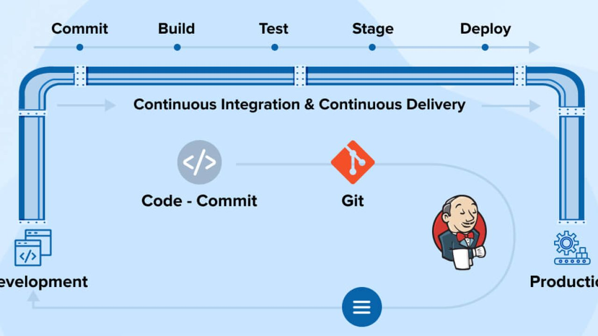

- [CI/CD](#cicd)
  - [What is CI/CD?](#what-is-cicd)
    - [CI](#ci)
    - [CD](#cd)
  - [What is a Webhook?](#what-is-a-webhook)
  - [Why, when and where do we create a CI/CD pipeline?](#why-when-and-where-do-we-create-a-cicd-pipeline)
    - [Nodes](#nodes)
  - [Difference between Delivery and Deployment in prod?](#difference-between-delivery-and-deployment-in-prod)

# CI/CD

## What is CI/CD?

CI/CD stand for continuous integration continuous delivery/deployment

It is the process of automating the steps contained within the software development life cycle; Plan, Design, Develop, Test and Deploy

CI/CD is about automating key aspects of the software development lifecycle, from integrating code changes to deploying them to production. It helps teams deliver high-quality software more efficiently by reducing manual effort, speeding up feedback loops, and increasing deployment frequency.

### CI

This involves automatically building and testing code changes frequently, typically multiple times a day or whenever changes are pushed to the version control repository. The goal of CI is to catch integration errors early in the development process, ensuring that new code additions don't break the existing codebase.

### CD

This is the process of automatically deploying code changes to production or staging environments after they pass through the CI pipeline. The goal of CD is to streamline the deployment process, making it fast, reliable, and repeatable. With continuous deployment, code changes can be released to users quickly and frequently.

## What is a Webhook?

A webhook is a mechanism for automatically triggering an action or notifying an external system when a certain event occurs.

An example of this would be on Amazing when you add an item to the basket it is checking first is that item in stock? If yes allow the item to be added to the basket. Then at the payment stage has the payment gone through? If yes send an email to notify the user of this. Has the item then been sent out for delivery? If yes notify the user that their item is on it's way.

A webhook is what allows all of these actions to me automated without this it wouldn't feasibly be possible for someone to do this for the billions of orders amazon gets each year.

## Why, when and where do we create a CI/CD pipeline?

A CI/CD pipeline is present in every role containing DevOps and is one of the core principles. This is because implementing a CI/CD allows you to release software faster. In turn this saves time doing these steps manually and it also saves money.

This process also allows for a consistent feedback loop. At the testing stage if something is wrong with the code such as a function being missing a log will be created. This log can then be sent back to the development team for them to fix.

### Nodes

We are going to set up a Jenkins master node which will be responsible for the automatic deployment of our code assuming it passes testing.

We are also going to set up a Jenkins agent node that will responsible for that testing and creating the log file. If any issues arise this log file can be looped back for the developers to fix.

## Difference between Delivery and Deployment in prod?

When the new code has been tested and is ready to be sent into the production environment you can either deliver this or deploy it.

If you were to deliver the new code it will not be live for the user to have access to. You would need to manually do this yourself by going into the app and doing npm start for example to get it running.

As for deployment this can be done automatically within the CI/CD pipeline with Jenkins. The code will be deployed and would be live within the prod environment with users being able to access it. This could be something along the lines of a new feature or bug fix.

A real life example would be when a movie has released they are delivered to the cinema weeks before they are actually airing. This can be helpful to check if there are an unforeseen issues with them. When the time comes they will then say this movie is airing come and see if so the user/member of the public can come and watch the film.

